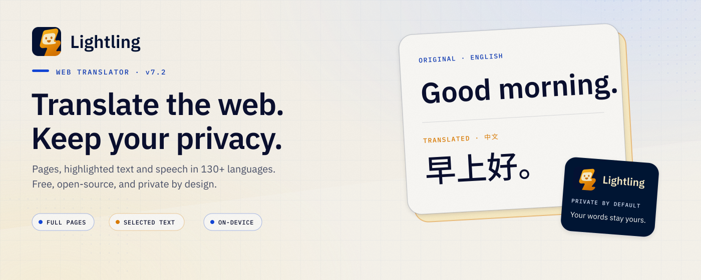
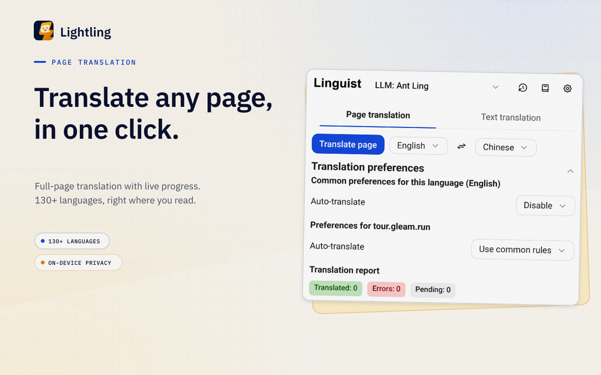
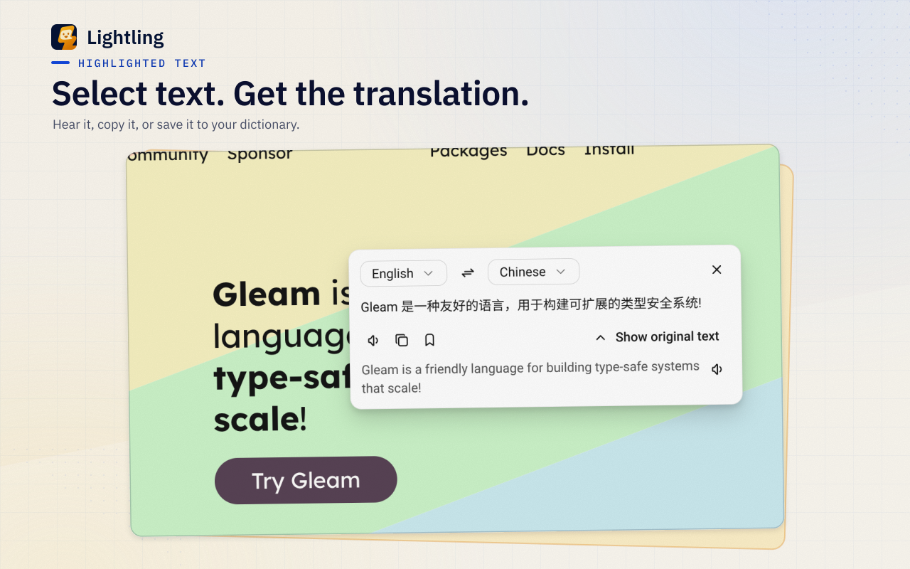
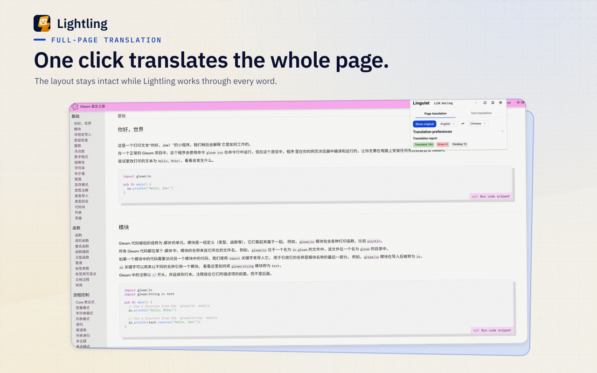
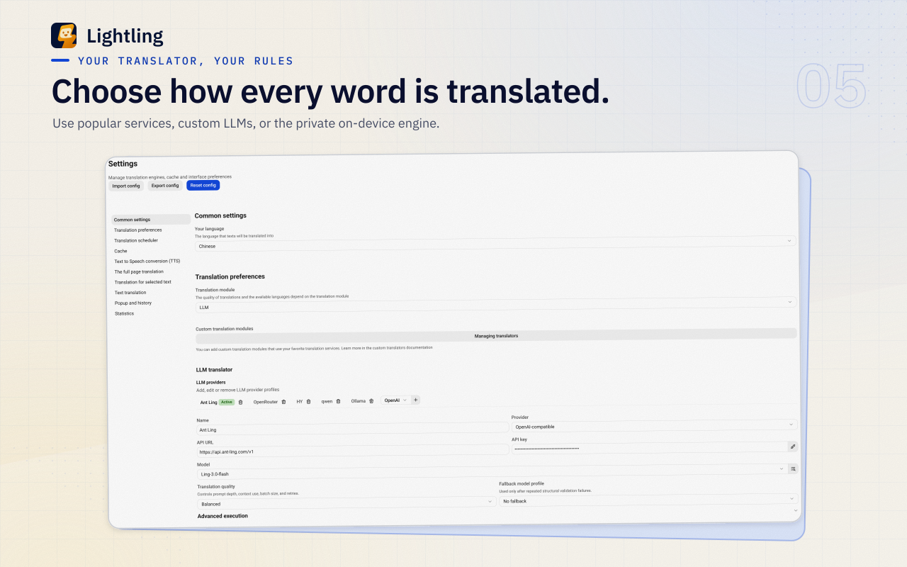
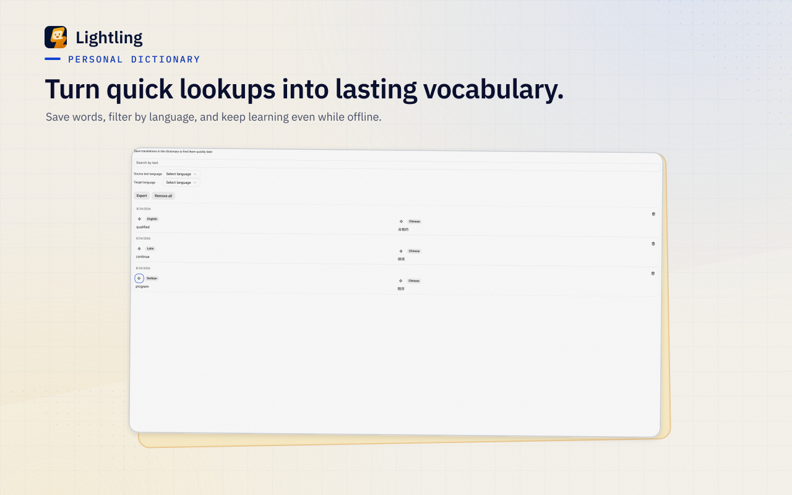
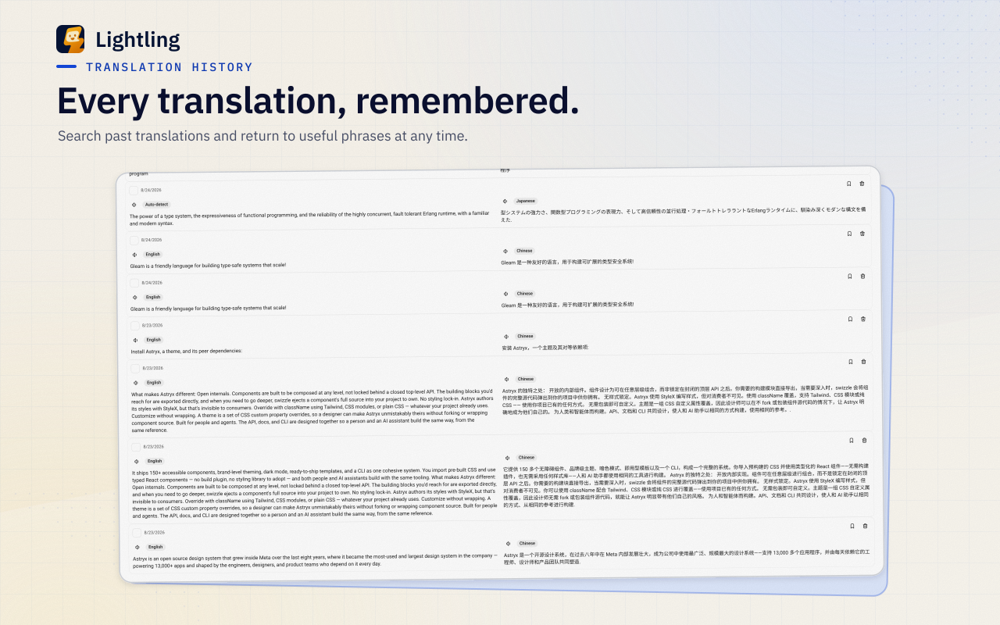

# Lightling



Lightling is a privacy-first browser extension for translating web pages, selected text, subtitles, messages, and custom input. It supports offline translation, custom translation backends, text-to-speech, translation history, and a personal dictionary.

> **Lightling is a fork of [Linguist](https://github.com/vitonsky/linguist). Most of the functionality is implemented by Linguist** — created by Robert Vitonsky and its contributors. This fork builds on their work.

## Features

- Full-page, selected-text, subtitle, message, and free-form text translation
- Built-in and custom translation services
- Offline translation with [Bergamot](https://github.com/browsermt/bergamot-translator)
- Personal dictionary and translation history
- Text-to-speech
- Automatic translation rules

See the [custom translator](./docs/CustomTranslator.md), [custom TTS](./docs/CustomTTS.md), and [offline translation](./docs/guides/OfflineTranslation.md) guides for configuration details.

## Installation

Download packaged builds from [Lightling releases](https://github.com/hewel/lightling/releases), or build the extension locally:

```sh
npm install
npm run build
```

The browser extension is emitted under `dist/`.

## Development

Install Node.js 22.12 or later, then run:

```sh
npm install
npm run dev
```

Use `npm test`, `npm run typecheck`, and `npm run lint` for validation.

## Screenshots

<table>
  <tr>
    <td></td>
    <td></td>
  </tr>
  <tr>
    <td></td>
    <td></td>
  </tr>
  <tr>
    <td></td>
    <td></td>
  </tr>
</table>

## Upstream and license

Lightling is a fork of [Linguist](https://github.com/vitonsky/linguist), created by Robert Vitonsky and its contributors.

The project is distributed under the BSD 3-Clause License. The original copyright notice, license conditions, and disclaimer are retained in [LICENSE](./LICENSE), as required by that license. The Linguist name and contributor names are not used to imply endorsement of Lightling.
